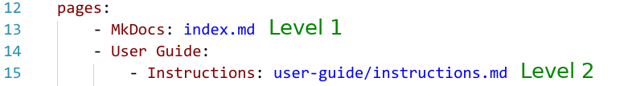

ReadTheDocs Dropdown for MkDocs
=======================
[![Pypi Version][pypi-image]][pypi-link]

  [pypi-image]: http://img.shields.io/pypi/v/mkdocs-rtd-dropdown.svg
  [pypi-link]: https://pypi.python.org/pypi/mkdocs-rtd-dropdown

A ReadTheDocs theme for [MkDocs](http://www.mkdocs.org/) with collapsing menu support.


How to install
----------

Install the ReadTheDocs Dropdown theme with pip:

```
pip install mkdocs-rtd-dropdown
```

Set the theme name to rtd-dropdown in your projects `mkdocs.yml`:

```
theme:
  name: 'rtd-dropdown'
```


How to use
--------

See the supplied `docs` folder as an example. The main limitation is each file name needs to be the same as the
first heading in each file. This seems to be a fairly common configuration.

MkDocs added navigation improvemetns which allows this theme to support more than 2 collapsing levels.

The stylesheets are currently only configured for 4 levels. Please reaise an issue if you need style support for more than that.


How to use (Old Version, pre-v1.0)
----------

Similar to [readthedocs.io](https://docs.readthedocs.io/en/latest/), this theme is built
assuming a flat file structure.

### File Structure (Old Version, pre-v1.0)

Right now, your documentation can only use the first two file levels. I'm working on 
adding support for a 3rd level. 



In the example above, MkDocs will be a linked-page on the sidebar (to index.md) while UserGuide
will be a category containing the pages nested under it (ex. Instructions which contains instructions.md)


**Note:** If you don't declare your doc-structure explicitly in mkdocs.yml, each folder is considered a file level.

### Collapsing

The dropdown menu is controlled by heading levels.

```
# Page Title    <-- H1

content, content, content

## Section      <-- H2

### Section     <-- H3
```

The rules for headings are essentially:

* If there is only one H1, it will be ignored and the page/file name will be the root dropdown element
  * Having 2 sub-menus with no choices was a wierd experience 
  * See [MkDocs](http://readthedocs.sheets.ch/) for an example
* If there are multiple H1, they each become dropdown elements
  * See [user-guide/instructions](http://readthedocs.sheets.ch/user-guide/instructions/) for an example

There is currently no support for H3+ dropdowns. I'm working on adding support to the next version.


Considerations
--------------

* Based on the ReadTheDocs theme build-into MkDocs
* Adds dropdown functionality to the sidebar (similar to ReadTheDocs)

For further discussion, see [this issue](https://github.com/mkdocs/mkdocs/issues/588#issuecomment-341931422).


Development
-----------

If you discover bugs or areas for improvement please feel free to submit issues or PRs.

<!-- Basic hit-counter, helps me decide which projects to dedicate time -->
[](https://github.com/cjsheets/mkdocs-rtd-dropdown)