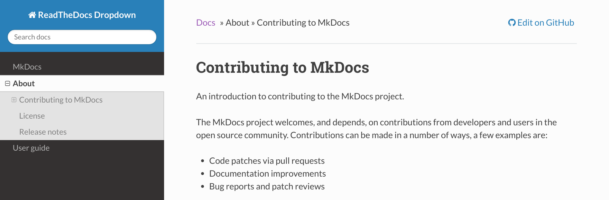

ReadTheDocs Dropdown for MkDocs
=======================
[![Pypi Version][pypi-image]][pypi-link]

  [pypi-image]: http://img.shields.io/pypi/v/mkdocs-rtd-dropdown.svg
  [pypi-link]: https://pypi.python.org/pypi/mkdocs-rtd-dropdown

A ReadTheDocs theme for [MkDocs](http://www.mkdocs.org/) with collapsing menu support.




How to use
----------

Install the ReadTheDocs Dropdown theme with pip:

```
pip install mkdocs-rtd-dropdown
```

Set the theme name to rtd-dropdown in your projects `mkdocs.yml`:

```
theme:
  name: 'rtd-dropdown'
```


Features
--------

* Based on the ReadTheDocs theme build-into MkDocs
* Adds dropdown functionality to the sidebar (similar to ReadTheDocs)

For further discussion, see [this issue](https://github.com/mkdocs/mkdocs/issues/588#issuecomment-341931422).


Considerations
--------------

ToDo


Development
-----------

This theme is stable but early in development. There may be changes to how folder structures
are parsed into subdirectories in future releases.

If you discover bugs or areas for improvement please feel free to submit issues or PRs.

<!-- Basic hit-counter, helps me decide which projects to dedicate time -->
[](https://github.com/cjsheets/mkdocs-rtd-dropdown)